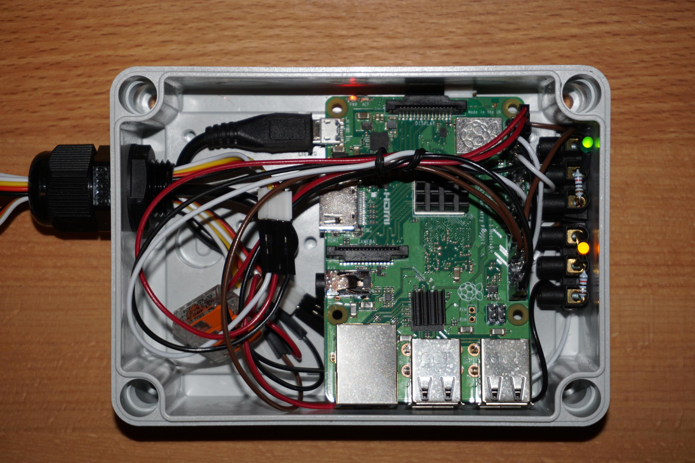

Door Control Hardware
=====================

Parts
-----

.. table:: Hardware Components

   == =================================== ===================================
   No Part Name                           Usage
   == =================================== ===================================
   1  Raspberry 3 or 4 with power supply  door controller
   2  M5Stack Mini 3A Relay Unit U023     door open relay
   3  M5Stack Mini 3A Relay Unit U023     door close relay
   4  M5Stack Hall Sensor U084            magnetic sensor for door closed
   5  M5Stack 1 to 3 HUB Unit U006        sensor cable extension
   6  M5Stack Unbuckled Grove Cable 50cm  sensor cable extension
      A034-C
   7  Adafruit Jumperset 40 wires         Raspi GPIO connection
      male/female, 15cm
   8  orange LED 11 mA + resistor 82 Ohms automatic is working (= time synced)
   9  green LED 11 mA + resistor 82 Ohms  MQTT connection to broker working
   == =================================== ===================================

Connections
-----------

Raspberry GPIO connection:

.. image:: /_static/hardware/gpio_connection.svg
   :scale: 150 %

This I/O configuration can be found on the Python/Raspberry side as *config.json*:

.. code-block:: json

    {
        "io": {
            "out_ready_led": 4,
            "out_network_status_led": 17,
            "out_open_command": 5,
            "out_close_command": 6,
            "in_door_closed": {"pin": 25, "active_state": true},
            "command_out_pulse_time_s": 2
        }
    }

Outdoor Case
------------

The Raspberry is enclosed in a case which is waterproof so there will not be any condensed water. It's good enougth to control the relays.

Electrical Considerations
-------------------------

Some notes about the electrical possibilities and limitations of the Raspberry 3+4:

- the GPIO devices must not consume more than 50 mA altogether
- one single GPIO output must not consume more than 16 mA
- Some outputs have a pullup and others have a pulldown behavior. If we choose the wrong behavior the startup or a reboot
  of the system lets the output relays switching unexpectedly. A pullup output sets the output to high until the application
  has been started which could be a big problem. For this project this means that the door will open or close on each
  startup which is an unwanted operation of the door.
- So the relay outputs have to be connected to GPIO 5 and 6 which have a pulldown resistor. A reboot of the system will not lead
  to an unwanted switch of the relays.
- GPIO power considerations this project:

  - Estimated limiting resistor for testing: (3.3V (measured output) - 1.7V (typical LED voltage))/20mA = 80Ohms
  - Voltage measurement of the used LED (limiting resistor 82Ohms): I=11mA (measured), R=82Ohm => U=R*I=82Ohm*0.011A=0.9V (limiting Resistor)
  - so a limiting resistor of 82 Ohms fits here for both LEDs used.
  - Relay coils: nominal power=0.2W, resistance=125Ohms => I=U/R=3.3V/125Ohms=26.4mA

.. note::

   The coil current consumption is too high (26.4mA instead of 16mA) but it's only for 2 seconds so this should
   damage nothing.
