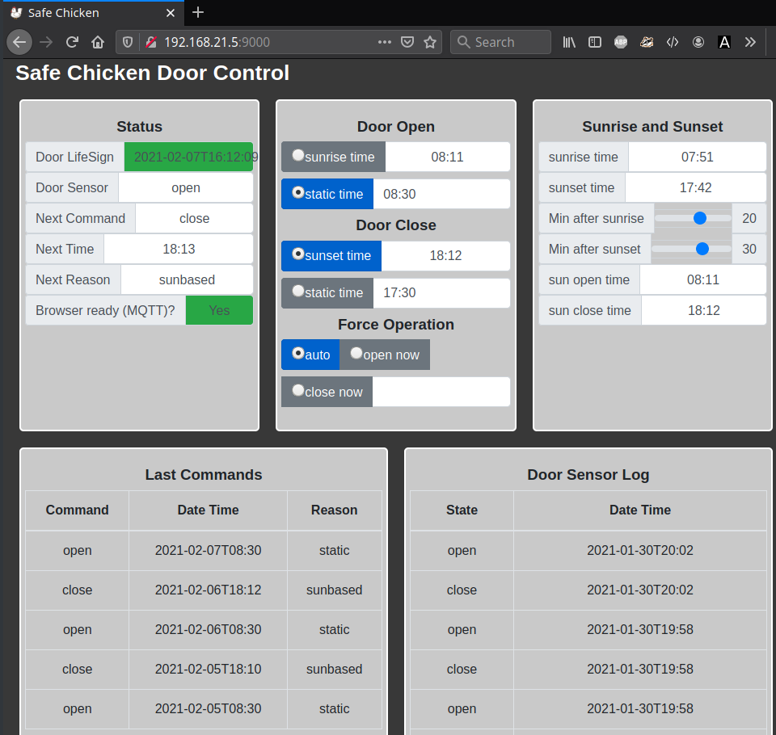

Web Application
===============

The web application's functions are generally described in the index and overview pages already.

Here are some technical details:

- The `Paho MQTT JavaScript client <https://github.com/eclipse/paho.mqtt.javascript>`_
  communicates to the MQTT broker running on the NAS
- `Bootstrap UI <https://getbootstrap.com/>`_ components 
- self-created simple communication adapter between MQTT and bootstrap html components

As the web app uses bootstrap containers it's responsive and looks good on multiple devices. On a desktop it looks like this:

